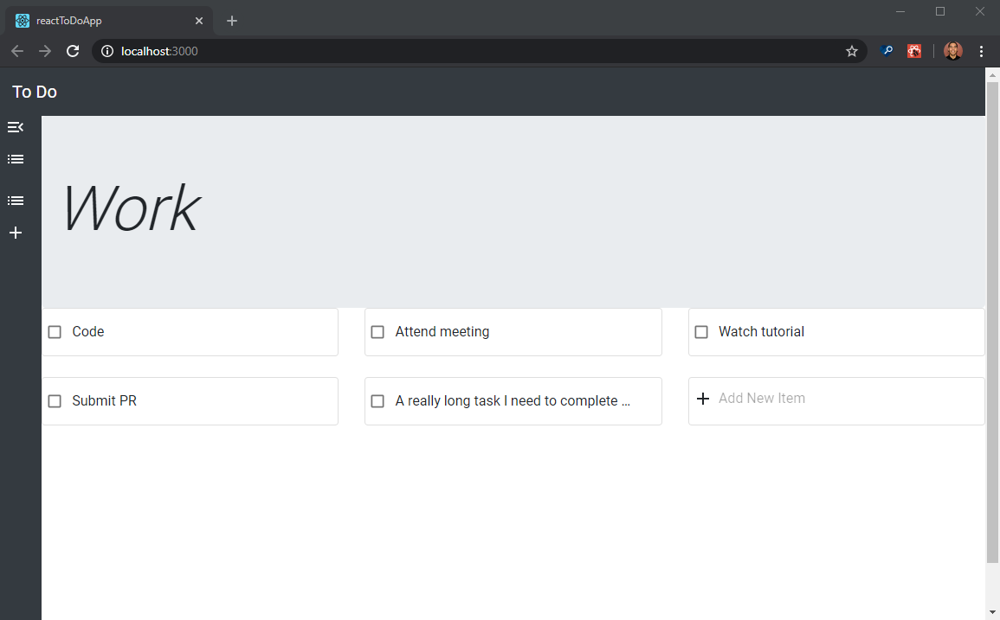
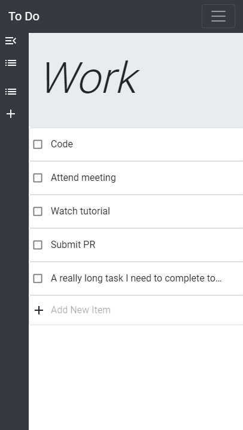

# reactToDoApp
---
A Simple to do list using React! The web app allows you to add your own todo list and items per list. 

# Motivation
I decided to create this project so I could quickly learn React basics. 

# Screenshots

# Technologies
1. [React](https://reactjs.org/)
2. [Create React App](https://create-react-app.dev/)
3. [React Testing Library](https://github.com/testing-library/react-testing-library)

# License
MIT License

Copyright (c) 2020 Isaac Flores

